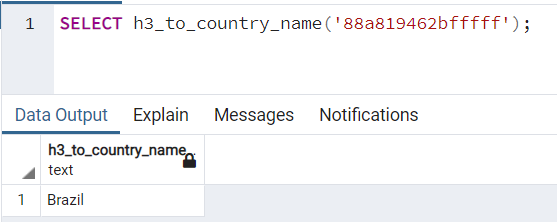

# h3-countries
Simple Postgres dataset and functions for mapping h3 indices or coordinates to country codes.

## Getting Started
The following instructions have been tested on Ubuntu 20.04 with Postgres 14. You may run into compatibility issues with older versions. 
Setup assumes that you already have **superuser** access to a Postgres database. 
1. On your Postgres server, install the `postgis` extension and `pgxnclient` extension manager if not already:
   - `sudo apt-get install postgis pgxnclient`
2. Use [`pgxn`](https://pgxn.org/) to install the [Postgres h3 bindings](https://github.com/bytesandbrains/h3-pg):
   - `pgxn install h3`
3. Create a copy of `.env.template`, call it `.env`, and configure the application with your Postgres connection URL and the path to the countries GeoJSON dataset.
4. Install dependencies:
   - `pip install -r requirements.txt`
5. Run the `load_borders.py` bootstrapping script:
   - `python load_borders.py`
   - This creates a table called `borders` with 3 columns:
     - `country_name (text)`: The full country name, e.g. `United States of America`.
     - `country_iso_a3 (text)`: The country ISO A3 code, e.g. `USA`.
     - `country_iso_a2 (text)`: The country ISO A2 code, e.g. `US`.
     - `numeric_code (integer)`: The numeric country code.
     - `geometry (geometry)`: The coordinates list defining the country borders as a polygon. This enables a variety of geospatial queries via `postgis`, e.g. `ST_CONTAINS`. 

## Functions
Simple macros leverage `h3` and `postgis` extensions to enable common queries.
- `h3_to_country_iso_a3 (_h3_index text)` and `h3_to_country_iso_a2 (_h3_index text)`
  - Description: Given an h3 index, returns the country ISO code (A2 or A3) that the hex centroid lies in.
  - Example Usage: `SELECT h3_to_country_iso_a3('88a819462bfffff');` -> `BRA`.
- `h3_to_country_name (_h3_index text)`
  - Description: Given an h3 index, returns the country name that the hex centroid lies in.
  - Example Usage: `SELECT h3_to_country_name('88a819462bfffff');` -> `Brazil`.
- `coordinates_to_country_iso_a3 (_latitude numeric, _longitude numeric)` and `coordinates_to_country_iso_a2 (_latitude numeric, _longitude numeric)`
  - Description: Given a coordinate pair, returns the country ISO code that the point lies in.
  - Example Usage: `SELECT coordinates_to_country_iso(24.4539, 54.3773);` -> `ARE`.
- `coordinates_to_country_name (_latitude numeric, _longitude numeric)`
  - Description: Given a coordinate pair, returns the country name that the point lies in.
  - Example Usage: `SELECT coordinates_to_country_name(24.4539, 54.3773);` -> `United Arab Emirates`.
